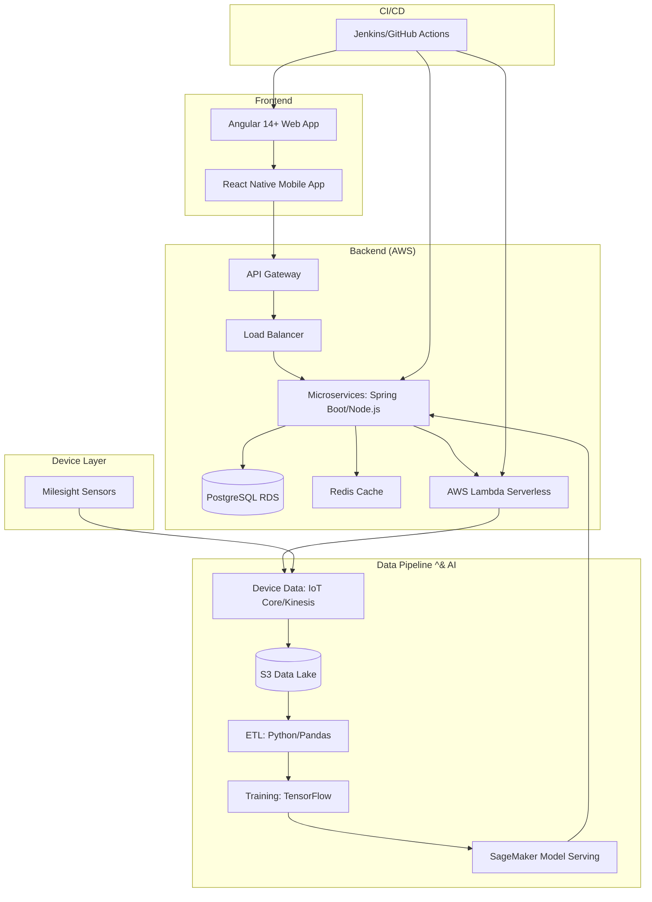
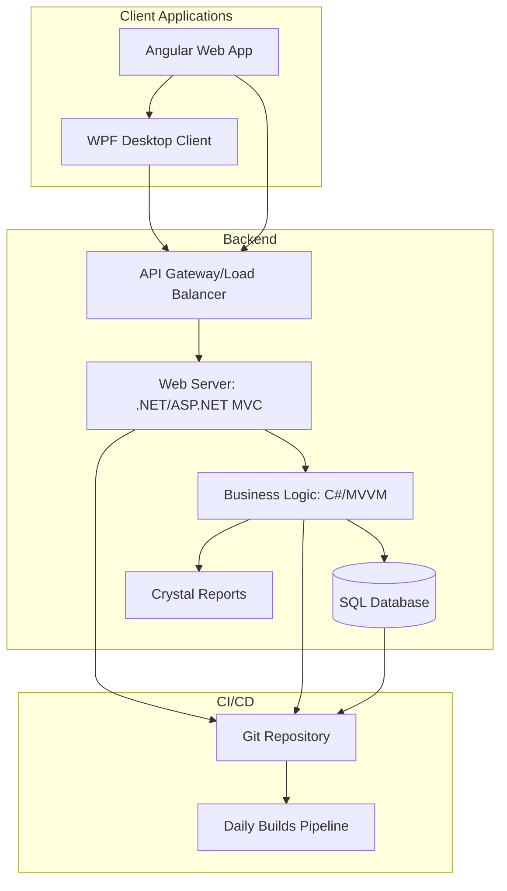
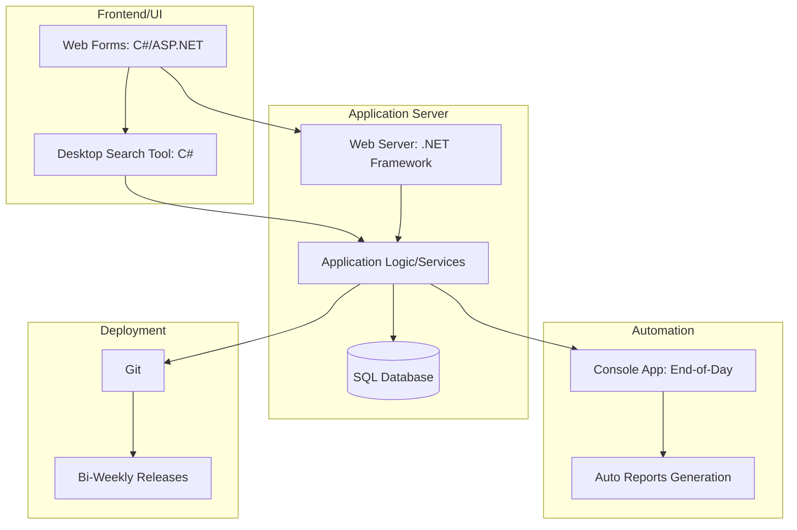
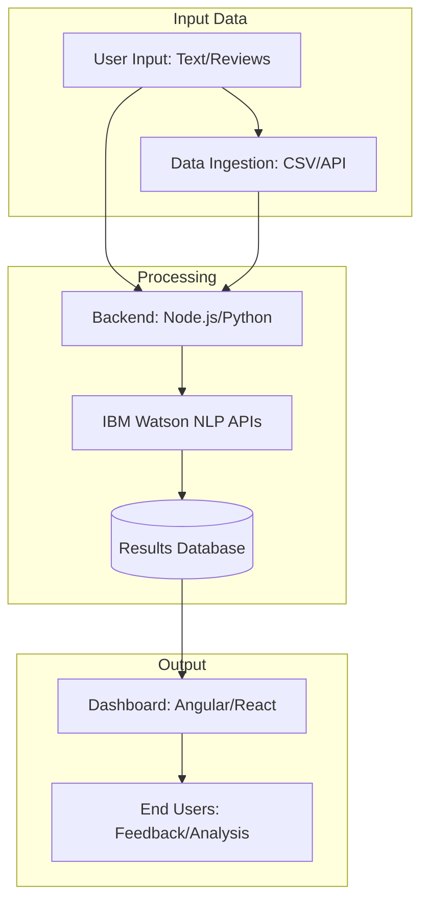
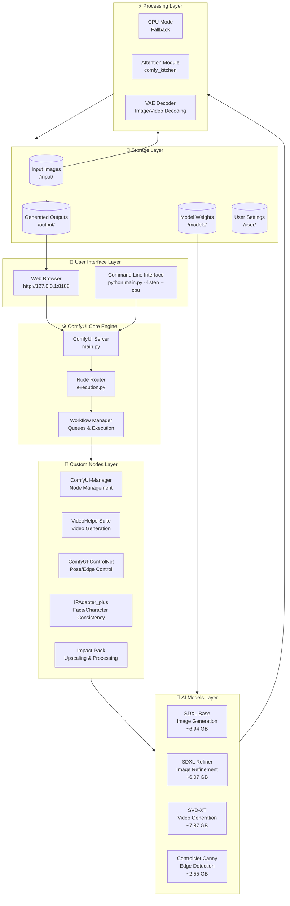

# Muhammad Saqeef Shabbir - IoT Project Architectures 
 
## Project Architecture Diagrams 
 
--- 
 
## 1. ParkSmart & BinWise - Smart City IoT Platform 
 

 
--- 
 
## 2. NFS Ascent - Asset-Based Financing Platform 
 

 
--- 
 
## 3. Sales & Distribution Pro - Retail Management 
 

 
--- 
 
## 4. NLP Sentiment Analyzer - Freelance Project 
 

--- 

## 5. ComfyUI with ImaginArt with custom nodes - Open Source Project 
 

--- 
 
## How to View These Diagrams 
 
1. On **GitHub**, these diagrams render automatically in the README 
2. In **VS Code**, install the "Markdown Preview Mermaid Support" extension 
3. Use **https://mermaid.live** to edit and export as images 
 
## About the Developer 
 
**Muhammad Saqeef Shabbir** 
- Senior Full Stack Engineer with 7+ years experience 
- Expertise: Angular, React, Spring Boot, Node.js, AWS, Azure 
- LinkedIn: [https://www.linkedin.com/in/muhammad-saqeef-shabbir-779668b3/](https://linkedin.com) 
- Portfolio: [https://portfolio-three-sepia-64.vercel.app/](https://portfolio-three-sepia-64.vercel.app) 
